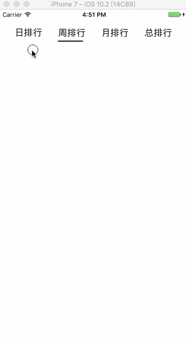

# ELSegmentView

## Requirements
- iOS 8.0+ / Mac OS X 10.11+ / SnapKit
- Xcode 8.0+
- Swift 3.0+
## Usage
  `ELSegmentView`使用`SnapKit`设置约束.
  ~~~ Swift
  class ViewController: UIViewController {

    override func viewDidLoad() {
        super.viewDidLoad()
        let titles = ["日排行","周排行","月排行","总排行"]
        let segmentView = ELSegmentView(titles: titles)
        view.addSubview(segmentView)
        segmentView.snp.makeConstraints { (make) in
            make.left.top.right.equalToSuperview()
            make.height.equalTo(64)
        }
    }

    override func didReceiveMemoryWarning() {
        super.didReceiveMemoryWarning()    
    }
  }
  ~~~
